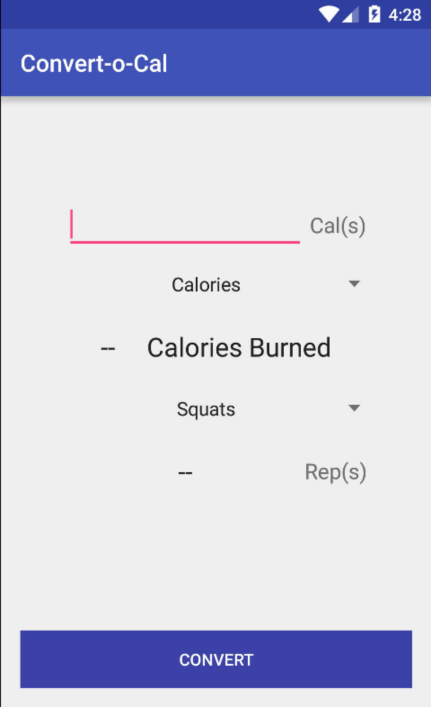
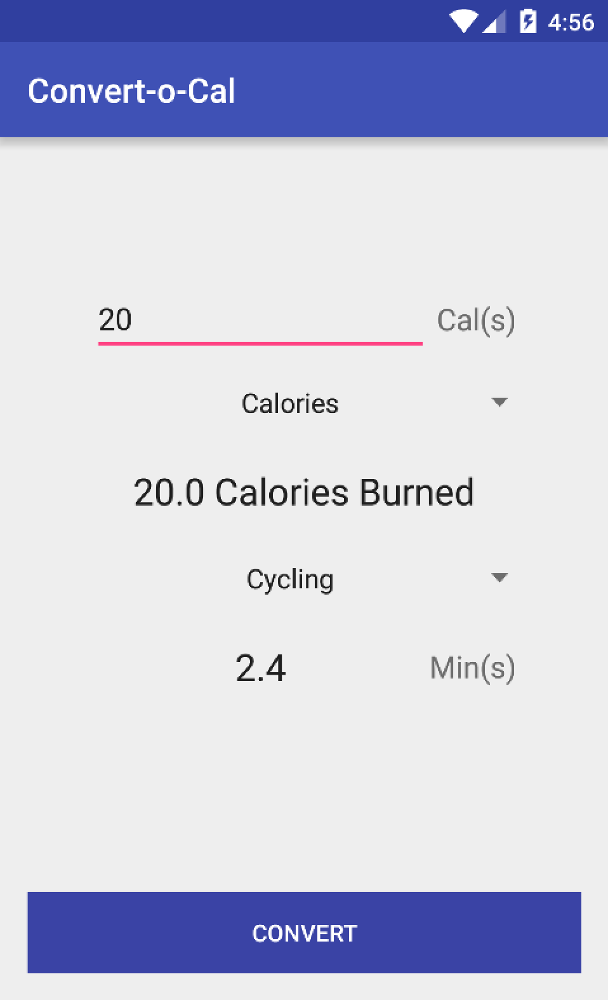
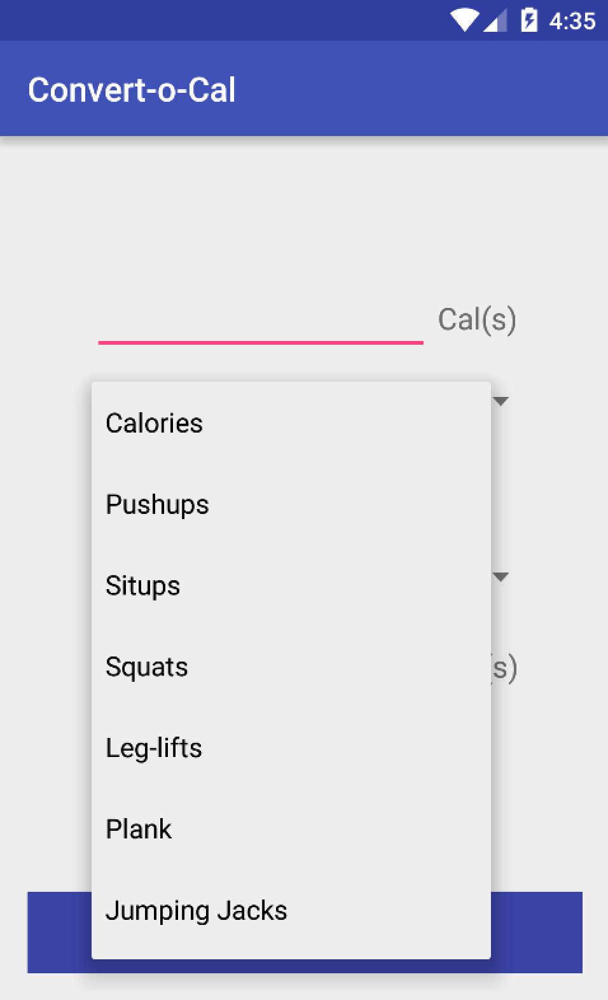
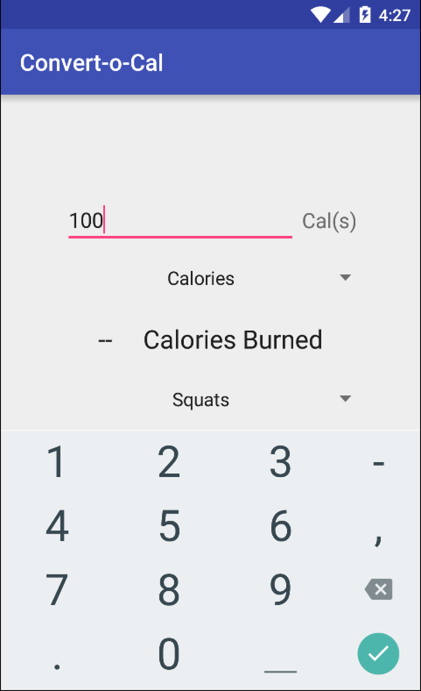

# PROG 01: Crunch Time

This app allows you to see how many calories you've burned doing a a certain amount of an exercise.  You can also see how much of an exercise that is equivalent to.  If you wanted to see how much of an exercise you need to do to burn a certain amount of calories, you can do that to.  The app uses the following conversions to 100 calories:

| Exercise       | Amount (for 100 cal) |
|----------------|----------------------|
| Pushup         | 350 Reps             |
| Situp          | 200 Reps             |
| Squats         | 225 Reps             |
| Leg-lift       | 25 Minutes           |
| Plank          | 25 Minutes           |
| Jumping Jacks  | 10 Minutes           |
| Pullup         | 100 Reps             |
| Cycling        | 12 Minutes           |
| Walking        | 20 Minutes           |
| Jogging        | 12 Minutes           |
| Swimming       | 13 Minutes           |
| Stair-Climbing | 15 Minutes           |

Extra Credit Done:

* Support all exercises, not just the ones in red, on the table (both calories burned and pairwise equivalent conversion).

* Allow a user to enter how many calories they want to burn. The user should be able to see how many reps/minutes of exercises they would need to burn their target amount of calories. For example: if the user enter 200 calories as a target, they should see that they need to do 700 pushups (yikes), 400 situps, 24 minutes of jogging, etc.

## Authors

Neil Argade ([neilargade@berkeley.edu](mailto:neilargade@berkeley.edu))

## Demo Video

See [Convert-o-Cal] (https://youtu.be/pgzseJzMYmc)

## Screenshots

## Acknowledgments

* None